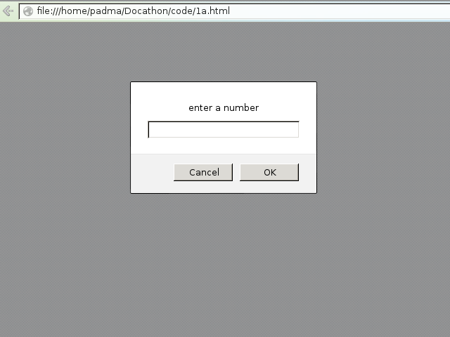

## Name of the Program:

### Tags used:
     
 - This is paragraph tag. It defines a paragraph.
     
     	</body>
     </html>

### Output:
*Steps for checking output-*

* Locate the file in the filesystem.
* `Right-click` on the file and select `open-with` firefox/iceweasel/chromium/chrome.
* Input the value and observe the output.

### Screenshots:

